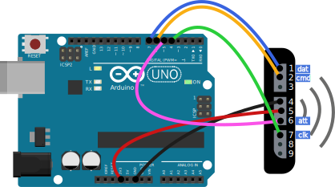

# Demo Arduino-Uno
**This project has only been tested on an Arduino Nano (atmega328p) and an Arduino Uno (atmega328p).**
- [PS controller DualShock2](https://en.wikipedia.org/wiki/DualShock)

## Demo for library
- [emdl-ps2device](https://github.com/esedev/emdl-ps2device)

### How to build
Just install [Just](https://github.com/casey/just) or read [Justfile](Justfile)

### Device connection diagram

#### Known Issues
- To successfully connect the gamepad, you need to turn off and turn on the Arduino, then turn on the gamepad.
